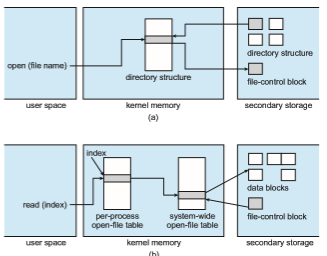

## Directory Implementation

The selection of directory-allocation and directory-management algorithms significantly affects the efficiency, performance, and reliability of the file sys- tem. In this section, we discuss the trade-offs involved in choosing one of these algorithms.  

**Figure 14.3** In-memory file-system structures. (a) File open. (b) File read.

### Linear List

The simplest method of implementing a directory is to use a linear list of file names with pointers to the data blocks. This method is simple to program but time-consuming to execute. To create a new file, we must first search the directory to be sure that no existing file has the same name. Then, we add a new entry at the end of the directory. To delete a file, we search the directory for the named file and then release the space allocated to it. To reuse the directory entry, we can do one of several things. We can mark the entry as unused (by assigning it a special name, such as an all-blank name, assigning it an invalid inode number (such as 0), or by including a used–unused bit in each entry), or we can attach it to a list of free directory entries. A third alternative is to copy the last entry in the directory into the freed location and to decrease the length of the directory. A linked list can also be used to decrease the time required to delete a file.

The real disadvantage of a linear list of directory entries is that finding a file requires a linear search. Directory information is used frequently, and users will notice if access to it is slow. In fact, many operating systems implement a software cache to store the most recently used directory information. A cache hit avoids the need to constantly reread the information from secondary storage. A sorted list allows a binary search and decreases the average search time. However, the requirement that the list be kept sorted may complicate creating and deleting files, since we may have to move substantial amounts of  

directory information to maintain a sorted directory. Amore sophisticated tree data structure, such as a balanced tree, might help here. An advantage of the sorted list is that a sorted directory listing can be produced without a separate sort step.

### Hash Table

Another data structure used for a file directory is a hash table. Here, a linear list stores the directory entries, but a hashdata structure is also used. The hash table takes a value computed from the file name and returns a pointer to the file name in the linear list. Therefore, it can greatly decrease the directory search time. Insertion and deletion are also fairly straightforward, although some provision must be made for collisions—situations in which two file names hash to the same location.

The major difficulties with a hash table are its generally fixed size and the dependence of the hash function on that size. For example, assume that we make a linear-probing hash table that holds 64 entries. The hash function con- verts file names into integers from 0 to 63 (for instance, by using the remainder of a division by 64). Ifwe later try to create a 65th file,wemust enlarge the direc- tory hash table—say, to 128 entries. As a result, we need a new hash function that must map file names to the range 0 to 127, and we must reorganize the existing directory entries to reflect their new hash-function values.

Alternatively, we can use a chained-overflow hash table. Each hash entry can be a linked list instead of an individual value, andwe can resolve collisions by adding the new entry to the linked list. Lookups may be somewhat slowed, because searching for a name might require stepping through a linked list of colliding table entries. Still, this method is likely to be much faster than a linear search through the entire directory.
