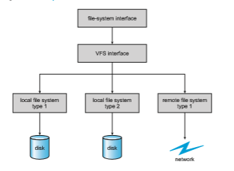

## Virtual File Systems

Aswe’ve seen, modern operating systemsmust concurrently support multiple types of file systems. But how does an operating system allow multiple types of file systems to be integrated into a directory structure? And how can users seamlessly move between file-system types as they navigate the file-system space? We now discuss some of these implementation details.

An obvious but suboptimal method of implementing multiple types of file systems is to write directory and file routines for each type. Instead, however, most operating systems, includingUNIX, use object-oriented techniques to sim- plify, organize, and modularize the implementation. The use of these methods allows very dissimilar file-system types to be implemented within the same structure, including network file systems, such as NFS. Users can access files containedwithinmultiple file systems on the local drive or even on file systems available across the network.

Data structures and procedures are used to isolate the basic system-call functionality from the implementation details. Thus, the file-system imple- mentation consists of three major layers, as depicted schematically in Figure 15.5. The first layer is the file-system interface, based on the open(), read(), write(), and close() calls and on file descriptors.  

**Figure 15.5** Schematic view of a virtual file system.

The second layer is called the **virtual file system** (**VFS**) layer. The VFS layer serves two important functions:

**1\.** It separates file-system-generic operations from their implementation by defining a clean VFS interface. Several implementations for the VFS inter- face may coexist on the same machine, allowing transparent access to different types of file systems mounted locally.

**2\.** It provides amechanism for uniquely representing afile throughout a net- work. The VFS is based on a file-representation structure, called a **vnode**, that contains a numerical designator for a network-wide unique file. (UNIX inodes are unique within only a single file system.) This network- wide uniqueness is required for support of network file systems. The kernel maintains one vnode structure for each active node (file or direc- tory).

Thus, the VFS distinguishes local files from remote ones, and local files are further distinguished according to their file-system types.

The VFS activates file-system-specific operations to handle local requests according to their file-system types and calls the NFS protocol procedures (or other protocol procedures for other network file systems) for remote requests. File handles are constructed from the relevant vnodes and are passed as argu- ments to these procedures. The layer implementing the file-system type or the remote-file-system protocol is the third layer of the architecture.

Let’s briefly examine the VFS architecture in Linux. The four main object types defined by the Linux VFS are:  

• The **inode object**, which represents an individual file

• The **fil object**, which represents an open file

• The **superblock object**, which represents an entire file system

• The **dentry object**, which represents an individual directory entry

For each of these four object types, the VFS defines a set of operations that may be implemented. Every object of one of these types contains a pointer to a function table. The function table lists the addresses of the actual functions that implement the defined operations for that particular object. For example, an abbreviated API for some of the operations for the file object includes:

• int open(. . .)—Open a file.

• int close(. . .)—Close an already-open file.

• ssize t read(. . .)—Read from a file.

• ssize t write(. . .)—Write to a file.

• int mmap(. . .)—Memory-map a file.

An implementation of the file object for a specific file type is required to imple- ment each function specified in the definition of the file object. (The complete definition of the file object is specified in the file struct file operations, which is located in the file /usr/include/linux/fs.h.)

Thus, the VFS software layer can perform an operation on one of these objects by calling the appropriate function from the object’s function table, without having to know in advance exactly what kind of object it is dealing with. The VFS does not know, or care, whether an inode represents a disk file, a directory file, or a remote file. The appropriate function for that file’s read() operation will always be at the same place in its function table, and the VFS software layer will call that function without caring how the data are actually read.
