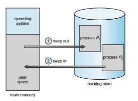
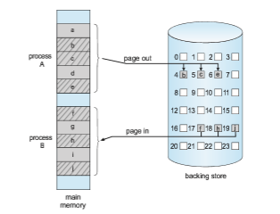

# Swapping

Process instructions and the data they operate on must be in memory to be executed. However, a process, or a portion of a process, can be **swapped** temporarily out of memory to a **backing store** and then brought back into memory for continued execution (Figure 9.19). Swapping makes it possible for the total physical address space of all processes to exceed the real physical memory of the system, thus increasing the degree of multiprogramming in a system.

**Figure 9.19** Standard swapping of two processes using a disk as a backing store.  

## Standard Swapping

Standard swapping involves moving entire processes between main memory and a backing store. The backing store is commonly fast secondary storage. It must be large enough to accommodate whatever parts of processes need to be stored and retrieved, and it must provide direct access to these memory images. When a process or part is swapped to the backing store, the data structures associated with the process must be written to the backing store. For a multithreaded process, all per-thread data structures must be swapped as well. The operating system must also maintain metadata for processes that have been swapped out, so they can be restored when they are swapped back in to memory.

The advantage of standard swapping is that it allows physical memory to be oversubscribed, so that the system can accommodate more processes than there is actual physical memory to store them. Idle or mostly idle processes are good candidates for swapping; any memory that has been allocated to these inactive processes can then be dedicated to active processes. If an inactive process that has been swapped out becomes active once again, it must then be swapped back in. This is illustrated in Figure 9.19.

## Swapping with Paging

Standard swappingwas used in traditional UNIX systems, but it is generally no longer used in contemporary operating systems, because the amount of time required to move entire processes between memory and the backing store is prohibitive. (An exception to this is Solaris,which still uses standard swapping, however only under dire circumstances when available memory is extremely low.)

Most systems, including Linux andWindows, nowuse a variation of swap- ping in which pages of a process—rather than an entire process—can be swapped. This strategy still allows physical memory to be oversubscribed, but does not incur the cost of swapping entire processes, as presumably only a small number of pageswill be involved in swapping. In fact, the term **_swapping_** now generally refers to standard swapping, and **_paging_** refers to swapping with paging. A **page out** operation moves a page from memory to the backing store; the reverse process is known as a **page in**. Swappingwith paging is illus- trated in Figure 9.20 where a subset of pages for processes _A_ and _B_ are being paged-out and paged-in respectively. As we shall see in Chapter 10, swapping with paging works well in conjunction with virtual memory.

## Swapping on Mobile Systems

Most operating systems for PCs and servers support swapping pages. In con- trast, mobile systems typically do not support swapping in any form. Mobile devices generally use flash memory rather than more spacious hard disks for nonvolatile storage. The resulting space constraint is one reason why mobile operating-systemdesigners avoid swapping. Other reasons include the limited number of writes that flash memory can tolerate before it becomes unreliable and the poor throughput between main memory and flash memory in these devices.  

**Figure 9.20** Swapping with paging.

Instead of using swapping, when free memory falls below a certain thresh- old, Apple’s iOS **_asks_** applications to voluntarily relinquish allocated mem- ory. Read-only data (such as code) are removed from main memory and later reloaded from flash memory if necessary. Data that have been modified (such as the stack) are never removed. However, any applications that fail to free up sufficient memory may be terminated by the operating system.

Android adopts a strategy similar to that used by iOS. It may terminate a process if insufficient free memory is available. However, before terminating a process, Android writes its **application state** to flash memory so that it can be quickly restarted.

Because of these restrictions, developers for mobile systemsmust carefully allocate and release memory to ensure that their applications do not use too much memory or suffer from memory leaks.

**_SYSTEM PERFORMANCE UNDER SWAPPING_**

Although swapping pages is more efficient than swapping entire processes, when a system is undergoing _any_ form of swapping, it is often a sign there are more active processes than available physical memory. There are generally two approaches for handling this situation: (1) terminate some processes, or (2) get more physical memory!  