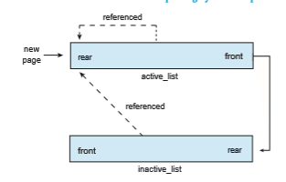
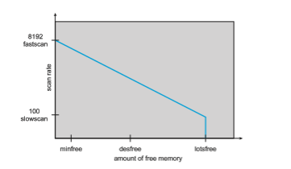

# Operating-System Examples

In this section, we describe how Linux, Windows and Solaris manage virtual memory.

## Linux

In Section 10.8.2, we discussed how Linux manages kernel memory using slab allocation. We now cover how Linux manages virtual memory. Linux uses demand paging, allocating pages from a list of free frames. In addition, it uses a global page-replacement policy similar to the LRU-approximation clock algo- rithm described in Section 10.4.5.2. To manage memory, Linux maintains two types of page lists: an active list and an inactive list. The active list contains the pages that are considered in use, while the inactive list con- tains pages that have not recently been referenced and are eligible to be reclaimed.  

**Figure 10.29** The Linux active list and inactive list structures.

Each page has an **_accessed_** bit that is set whenever the page is referenced. (The actual bits used to mark page access vary by architecture.) When a page is first allocated, its accessed bit is set, and it is added to the rear of the active list. Similarly, whenever a page in the active list is referenced, its accessed bit is set, and the page moves to the rear of the list. Periodically, the accessed bits for pages in the active list are reset. Over time, the least recently used page will be at the front of the active list. From there, it may migrate to the rear of the inactive list. If a page in the inactive list is referenced, it moves back to the rear of the active list. This pattern is illustrated in Figure 10.29.

The two lists are kept in relative balance, andwhen the active list grows much larger than the inactive list, pages at the front of the active list move to the inactive list, where they become eligible for reclamation. The Linux kernel has a page-out daemon process kswapd that periodically awak- ens and checks the amount of free memory in the system. If free memory falls below a certain threshold, kswapd begins scanning pages in the inac- tive list and reclaiming them for the free list. Linux virtual memory man- agement is discussed in greater detail in Chapter 20.

## Windows

Windows 10 supports 32- and 64-bit systems running on Intel (IA-32 and x86- 64) and ARM architectures. On 32-bit systems, the default virtual address space of a process is 2 GB, although it can be extended to 3 GB. 32-bit systems support 4 GB of physical memory. On 64-bit systems, Windows 10 has a 128-TB vir- tual address space and supports up to 24 TB of physical memory. (Versions of Windows Server support up to 128 TB of physicalmemory.)Windows 10 imple- ments most of the memory-management features described thus far, including shared libraries, demand paging, copy-on-write, paging, and memory com- pression.  

Windows 10 implements virtual memory using demand paging with **clus- tering**, a strategy that recognizes locality of memory references and therefore handles page faults by bringing in not only the faulting page but also several pages immediately preceding and following the faulting page. The size of a cluster varies by page type. For a data page, a cluster contains three pages(the page before and the page after the faulting page); all other page faults have a cluster size of seven.

A key component of virtual memory management in Windows 10 is working-set management. When a process is created, it is assigned a working- set minimum of 50 pages and a working-set maximum of 345 pages. The **working-set minimum** is the minimum number of pages the process is guar- anteed to have in memory; if sufficient memory is available, a process may be assigned as many pages as its **working-set maximum**. Unless a process is con- figured with **hard working-set limits**, these values may be ignored. A process can grow beyond its working-set maximum if sufficient memory is available. Similarly, the amount of memory allocated to a process can shrink below the minimum in periods of high demand for memory.

Windows uses the LRU-approximation clock algorithm, as described in Sec- tion 10.4.5.2, with a combination of local and global page-replacement policies. The virtual memory manager maintains a list of free page frames. Associated with this list is a threshold value that indicates whether sufficient free memory is available. If a page fault occurs for a process that is below its working- set maximum, the virtual memory manager allocates a page from the list of free pages. If a process that is at its working-set maximum incurs a page fault and sufficient memory is available, the process is allocated a free page, which allows it to grow beyond its working-setmaximum. If the amount of freemem- ory is insufficient, however, the kernel must select a page from the process’s working set for replacement using a local LRU page-replacement policy.

When the amount of free memory falls below the threshold, the vir- tual memory manager uses a global replacement tactic known as **automatic working-set trimming** to restore the value to a level above the threshold. Automatic working-set trimming works by evaluating the number of pages allocated to processes. If a process has been allocated more pages than its working-set minimum, the virtual memory manager removes pages from the working set until either there is sufficient memory available or the process has reached its working-set minimum. Larger processes that have been idle are targeted before smaller, active processes. The trimming procedure continues until there is sufficient free memory, even if it is necessary to remove pages from a process already below its working set minimum. Windows performs working-set trimming on both user-mode and system processes.

## Solaris

In Solaris, when a thread incurs a page fault, the kernel assigns a page to the faulting thread from the list of free pages it maintains. Therefore, it is imperative that the kernel keep a sufficient amount of free memory available. Associated with this list of free pages is a parameter—lotsfree—that repre- sents a threshold to begin paging. The lotsfree parameter is typically set to 1∕64 the size of the physical memory. Four times per second, the kernel checks whether the amount of free memory is less than lotsfree. If the number of  

free pages falls below lotsfree, a process known as a **pageout** starts up. The pageout process is similar to the second-chance algorithm described in Section 10.4.5.2, except that it uses two hands while scanning pages, rather than one.

The pageout process works as follows: The front hand of the clock scans all pages in memory, setting the reference bit to 0. Later, the back hand of the clock examines the reference bit for the pages inmemory, appending each page whose reference bit is still set to 0 to the free list and writing its contents to secondary storage if it has been modified. Solaris also manages minor page faults by allowing a process to reclaim a page from the free list if the page is accessed before being reassigned to another process.

The pageout algorithm uses several parameters to control the rate at which pages are scanned (known as the scanrate). The scanrate is expressed in pages per second and ranges from slowscan to fastscan. When free memory falls below lotsfree, scanning occurs at slowscan pages per second and progresses to fastscan, depending on the amount of free memory available. The default value of slowscan is 100 pages per second. Fastscan is typically set to the value (total physical pages)/2 pages per second, with a maximum of 8,192 pages per second. This is shown in Figure 10.30 (with fastscan set to the maximum).

The distance (in pages) between the hands of the clock is determined by a system parameter, handspread. The amount of time between the front hand’s clearing a bit and the back hand’s investigating its value depends on the scanrate and the handspread. If scanrate is 100 pages per second and handspread is 1,024 pages, 10 seconds can pass between the time a bit is set by the front hand and the time it is checked by the back hand. However, because of the demands placed on thememory system, a scanrate of several thousand is not uncommon. This means that the amount of time between clearing and investigating a bit is often a few seconds.

**Figure 10.30** Solaris page scanner.  

As mentioned above, the pageout process checks memory four times per second. However, if free memory falls below the value of desfree (the desired amount of free memory in the system), pageout will run a hundred times per second with the intention of keeping at least desfree free memory available (Figure 10.30). If the pageout process is unable to keep the amount of free memory at desfree for a 30-second average, the kernel begins swapping processes, thereby freeing all pages allocated to swapped processes. In general, the kernel looks for processes that have been idle for long periods of time. If the system is unable to maintain the amount of free memory at minfree, the pageout process is called for every request for a new page.

The page-scanning algorithm skips pages belonging to libraries that are being shared by several processes, even if they are eligible to be claimed by the scanner. The algorithm also distinguishes between pages allocated to processes and pages allocated to regular data files. This is known as **priority paging** and is covered in Section 14.6.2.