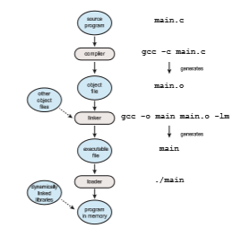

# Linkers and Loaders

Usually, a program resides on disk as a binary executable file—for example, a.out or prog.exe. To run on a CPU, the programmust be brought into mem- ory and placed in the context of a process. In this section, we describe the steps in this procedure, from compiling a program to placing it in memory, where it becomes eligible to run on an available CPU core. The steps are highlighted in Figure 2.11.

Source files are compiled into object files that are designed to be loaded into any physical memory location, a format known as an **relocatable object fil** . Next, the **linker** combines these relocatable object files into a single binary **executable** file. During the linking phase, other object files or libraries may be included aswell, such as the standard C ormath library (specifiedwith the flag -lm).

A **loader** is used to load the binary executable file into memory, where it is eligible to run on a CPU core. An activity associated with linking and loading is **relocation**, which assigns final addresses to the program parts and adjusts code and data in the program tomatch those addresses so that, for example, the code can call library functions and access its variables as it executes. In Figure 2.11, we see that to run the loader, all that is necessary is to enter the name of the executable file on the command line. When a program name is entered on the  

**Figure 2.11** The role of the linker and loader.

command line on UNIX systems—for example, ./main—the shell first creates a new process to run the program using the fork() system call. The shell then invokes the loader with the exec() system call, passing exec() the name of the executable file. The loader then loads the specified program into memory using the address space of the newly created process. (When a GUI interface is used, double-clicking on the icon associated with the executable file invokes the loader using a similar mechanism.)

The process described thus far assumes that all libraries are linked into the executable file and loaded into memory. In reality, most systems allow a program to dynamically link libraries as the program is loaded. Windows, for instance, supports dynamically linked libraries (**DLLs**). The benefit of this approach is that it avoids linking and loading libraries that may end up not being used into an executable file. Instead, the library is conditionally linked and is loaded if it is required during program run time. For example, in Figure 2.11, the math library is not linked into the executable file main. Rather, the linker inserts relocation information that allows it to be dynamically linked and loaded as the program is loaded. We shall see in Chapter 9 that it is possible for multiple processes to share dynamically linked libraries, resulting in a significant savings in memory use.

Object files and executable files typically have standard formats that include the compiled machine code and a symbol table containing metadata about functions and variables that are referenced in the program. For UNIX and Linux systems, this standard format is known as ELF (for **Executable and Linkable Format**). There are separate ELF formats for relocatable and  

**_ELF FORMAT_**

Linux provides various commands to identify and evaluate ELF files. For example, the file command determines a file type. If main.o is an object file, and main is an executable file, the command

file main.o

will report that main.o is an ELF relocatable file, while the command

file main

will report that main is an ELF executable. ELF files are divided into a number of sections and can be evaluated using the readelf command.

executable files. One piece of information in the ELF file for executable files is the program’s **_entry point,_** which contains the address of the first instruction to be executed when the program runs. Windows systems use the **Portable Executable** (PE) format, and macOS uses the **Mach-O** format.