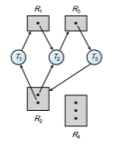
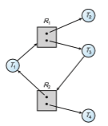

# Deadlock Characterization

In the previous section we illustrated how deadlock could occur in multi- threaded programming using mutex locks. We now look more closely at con- ditions that characterize deadlock.

## Necessary Conditions

Adeadlock situation can arise if the following four conditions hold simultane- ously in a system:

**1. Mutual exclusion**. At least one resource must be held in a nonsharable mode; that is, only one thread at a time can use the resource. If another thread requests that resource, the requesting threadmust be delayeduntil the resource has been released.

**2. Hold and wait**. A thread must be holding at least one resource and waiting to acquire additional resources that are currently being held by other threads.

**3. No preemption**. Resources cannot be preempted; that is, a resource can be released only voluntarily by the thread holding it, after that thread has completed its task.

**4. Circular wait**. A set _{T_ 0, _T_ 1, ..., _Tn}_ of waiting threadsmust exist such that _T_ 0 is waiting for a resource held by _T_ 1, _T_ 1 is waiting for a resource held by _T_ 2, ..., _Tn_−1 is waiting for a resource held by _Tn_, and _Tn_ is waiting for a resource held by _T_ 0.

We emphasize that all four conditions must hold for a deadlock to occur. The circular-wait condition implies the hold-and-wait condition, so the four  


```
/* thread one runs in this function */ void *do work one(void *param) {

int done = 0;

while (!done) { pthread mutex lock(&first mutex); if (**pthread mutex trylock**(&second mutex)) {

/** * Do some work */

pthread mutex unlock(&second mutex); pthread mutex unlock(&first mutex); done = 1;

} else

pthread mutex unlock(&first mutex); }

pthread exit(0); }

/* thread two runs in this function */ void *do work two(void *param) {

int done = 0;

while (!done) { pthread mutex lock(&second mutex); if (**pthread mutex trylock**(&first mutex)) {

/** * Do some work */

pthread mutex unlock(&first mutex); pthread mutex unlock(&second mutex); done = 1;

} else

pthread mutex unlock(&second mutex); }

pthread exit(0); }
```
**Figure 8.2** Livelock example.  


**Figure 8.3** Resource-allocation graph for program in Figure 8.1.

conditions are not completely independent. We shall see in Section 8.5, how- ever, that it is useful to consider each condition separately.

## Resource-Allocation Graph

Deadlocks can be described more precisely in terms of a directed graph called a **system resource-allocation graph**. This graph consists of a set of vertices _V_ and a set of edges _E_. The set of vertices_V_ is partitioned into two different types of nodes: _T_ = _{T_ 1, _T_ 2, ..., _Tn}_, the set consisting of all the active threads in the system, and _R_ = _{R_ 1, _R_ 2, ..., _Rm}_, the set consisting of all resource types in the system.

A directed edge from thread _Ti_ to resource type _Rj_ is denoted by _Ti_ → _Rj_; it signifies that thread _Ti_ has requested an instance of resource type _Rj_ and is currently waiting for that resource. A directed edge from resource type _Rj_ to thread _Ti_ is denoted by _Rj_ → _Ti_; it signifies that an instance of resource type _Rj_ has been allocated to thread _Ti_. A directed edge _Ti_ → _Rj_ is called a **request edge**; a directed edge _Rj_ → _Ti_ is called an **assignment edge**.

Pictorially, we represent each thread _Ti_ as a circle and each resource type _Rj_ as a rectangle. As a simple example, the resource allocation graph shown in Figure 8.3 illustrates the deadlock situation from the program in Figure 8.1. Since resource type _Rj_ may have more than one instance, we represent each such instance as a dot within the rectangle. Note that a request edge points only to the rectangle _Rj_, whereas an assignment edge must also designate one of the dots in the rectangle.

When thread _Ti_ requests an instance of resource type _Rj_, a request edge is inserted in the resource-allocation graph. When this request can be fulfilled, the request edge is **_instantaneously_** transformed to an assignment edge.When the thread no longer needs access to the resource, it releases the resource. As a result, the assignment edge is deleted.

The resource-allocation graph shown in Figure 8.4 depicts the following situation.

• The sets _T, R,_ and _E_:

◦ _T_ = _{T_ 1, _T_ 2, _T_ 3} ◦ _R_ = _{R_ 1, _R_ 2, _R_ 3, _R_ 4}  


**Figure 8.4** Resource-allocation graph.

◦ _E_ = _{T_ 1 → _R_ 1, _T_ 2 → _R_ 3, _R_ 1 → _T_ 2, _R_ 2 → _T_ 2, _R_ 2 → _T_ 1, _R_ 3 → _T_ 3} • Resource instances:

◦ One instance of resource type _R_ 1

◦ Two instances of resource type _R_ 2

◦ One instance of resource type _R_ 3

◦ Three instances of resource type _R_ 4

• Thread states:

◦ Thread _T_ 1 is holding an instance of resource type _R_ 2 and is waiting for an instance of resource type _R_ 1.

◦ Thread _T_ 2 is holding an instance of _R_ 1 and an instance of _R_ 2 and is waiting for an instance of _R_ 3.

◦ Thread _T_ 3 is holding an instance of _R_ 3.

Given the definition of a resource-allocation graph, it can be shown that, if the graph contains no cycles, then no thread in the system is deadlocked. If the graph does contain a cycle, then a deadlock may exist.

If each resource type has exactly one instance, then a cycle implies that a deadlock has occurred. If the cycle involves only a set of resource types, each of which has only a single instance, then a deadlock has occurred. Each thread involved in the cycle is deadlocked. In this case, a cycle in the graph is both a necessary and a sufficient condition for the existence of deadlock.

If each resource type has several instances, then a cycle does not necessarily imply that a deadlock has occurred. In this case, a cycle in the graph is a necessary but not a sufficient condition for the existence of deadlock.

To illustrate this concept, we return to the resource-allocation graph depicted in Figure 8.4. Suppose that thread _T_ 3 requests an instance of resource type _R_ 2. Since no resource instance is currently available, we add a request  



**Figure 8.5** Resource-allocation graph with a deadlock.

edge _T_ 3 → _R_ 2 to the graph (Figure 8.5). At this point, two minimal cycles exist in the system:

_T_ 1 → _R_ 1 → _T_ 2 → _R_ 3 → _T_ 3 → _R_ 2 → _T_ 1 _T_ 2 → _R_ 3 → _T_ 3 → _R_ 2 → _T_ 2

Threads _T_ 1, _T_ 2, and _T_ 3 are deadlocked. Thread _T_ 2 is waiting for the resource _R_ 3, which is held by thread _T_ 3. Thread _T_ 3 is waiting for either thread _T_ 1 or thread _T_ 2 to release resource _R_ 2. In addition, thread _T_ 1 is waiting for thread _T_ 2 to release resource _R_ 1.

Now consider the resource-allocation graph in Figure 8.6. In this example, we also have a cycle:

**Figure 8.6** Resource-allocation graph with a cycle but no deadlock.  


However, there is no deadlock. Observe that thread _T_ 4 may release its instance of resource type _R_ 2. That resource can then be allocated to _T_ 3, breaking the cycle.

In summary, if a resource-allocation graph does not have a cycle, then the system is **_not_** in a deadlocked state. If there is a cycle, then the system **_may_** or **_may not_** be in a deadlocked state. This observation is important when we deal with the deadlock problem.