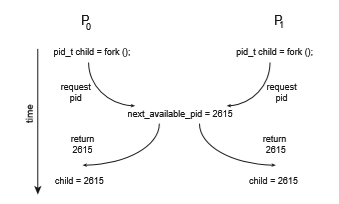

# The Critical-Section Problem

We begin our consideration of process synchronization by discussing the so- called critical-section problem. Consider a system consisting of _n_ processes {_P_0,_P_1, _..._,_Pn_−1}. Each process has a segment of code, called a **critical section**, in which the process may be accessing — and updating — data that is shared with at least one other process. The important feature of the system is that, when one process is executing in its critical section, no other process is allowed to execute in its critical section. That is, no two processes are executing in their critical sections at the same time. The **_critical-section problem_** is to design a protocol that the processes can use to synchronize their activity so as to cooperatively share data. Each process must request permission to enter its critical section. The section of code implementing this request is the **entry section**. The critical section may be followed by an **exit section**. The remaining code is the **remainder section**. The general structure of a typical process is shown in Figure 6.1. The entry section and exit section are enclosed in boxes to highlight these important segments of code.

A solution to the critical-section problem must satisfy the following three requirements:

**1. Mutual exclusion**. If process _Pi_ is executing in its critical section, then no other processes can be executing in their critical sections.

**2. Progress**. If no process is executing in its critical section and some pro- cesses wish to enter their critical sections, then only those processes that are not executing in their remainder sections can participate in decid- ing which will enter its critical section next, and this selection cannot be postponed indefinitely.
```
while (true) {

_entry section_

critical section

_exit section_

remainder section

}
```
**Figure 6.1** General structure of a typical process.  

**3. Bounded waiting**. There exists a bound, or limit, on the number of times that other processes are allowed to enter their critical sections after a process has made a request to enter its critical section and before that request is granted.

We assume that each process is executing at a nonzero speed. However, we can make no assumption concerning the relative speed of the _n_ processes.

At a given point in time, many kernel-mode processes may be active in the operating system. As a result, the code implementing an operating system (**_kernel code_**) is subject to several possible race conditions. Consider as an example a kernel data structure that maintains a list of all open files in the system. This list must be modifiedwhen a new file is opened or closed (adding the file to the list or removing it from the list). If two processeswere to open files simultaneously, the separate updates to this list could result in a race condition.

Another example is illustrated in Figure 6.2. In this situation, two pro- cesses, _P_0 and _P_1, are creating child processes using the fork() system call. Recall from Section 3.3.1 that fork() returns the process identifier of the newly created process to the parent process. In this example, there is a race condi- tion on the variable kernel variable next available pid which represents the value of the next available process identifier. Unless mutual exclusion is provided, it is possible the same process identifier number could be assigned to two separate processes.

Other kernel data structures that are prone to possible race conditions include structures for maintaining memory allocation, for maintaining process lists, and for interrupt handling. It is up to kernel developers to ensure that the operating system is free from such race conditions.

The critical-section problem could be solved simply in a single-core envi- ronment if we could prevent interrupts from occurring while a shared variable was being modified. In this way, we could be sure that the current sequence


**Figure 6.2** Race condition when assigning a pid.  of instructions would be allowed to execute in order without preemption. No other instructions would be run, so no unexpected modifications could be made to the shared variable.

Unfortunately, this solution is not as feasible in a multiprocessor environ- ment. Disabling interrupts on a multiprocessor can be time consuming, since the message is passed to all the processors. This message passing delays entry into each critical section, and system efficiency decreases. Also consider the effect on a system’s clock if the clock is kept updated by interrupts.

Two general approaches are used to handle critical sections in operating systems: **preemptive kernels** and **nonpreemptive kernels**. A preemptive ker- nel allows a process to be preempted while it is running in kernel mode. A nonpreemptive kernel does not allow a process running in kernel mode to be preempted; a kernel-mode process will run until it exits kernel mode, blocks, or voluntarily yields control of the CPU.

Obviously, a nonpreemptive kernel is essentially free from race conditions on kernel data structures, as only one process is active in the kernel at a time. We cannot say the same about preemptive kernels, so they must be carefully designed to ensure that shared kernel data are free from race conditions. Pre- emptive kernels are especially difficult to design for SMP architectures, since in these environments it is possible for two kernel-mode processes to run simultaneously on different CPU cores.

Why, then, would anyone favor a preemptive kernel over a nonpreemp- tive one? A preemptive kernel may be more responsive, since there is less risk that a kernel-mode process will run for an arbitrarily long period before relin- quishing the processor to waiting processes. (Of course, this risk can also be minimized by designing kernel code that does not behave in this way.) Fur- thermore, a preemptive kernel is more suitable for real-time programming, as it will allow a real-time process to preempt a process currently running in the kernel.