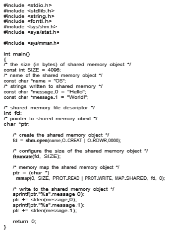
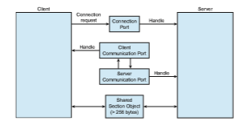
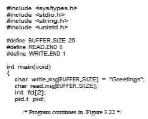
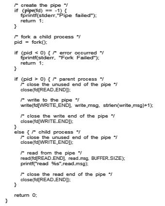
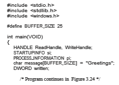
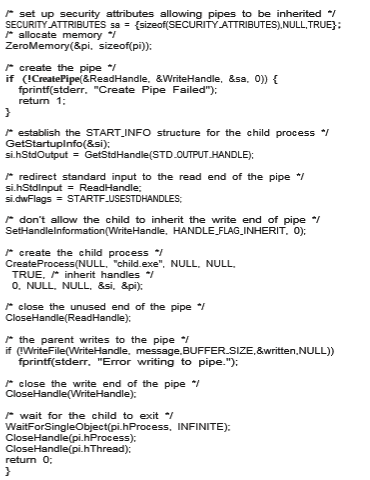
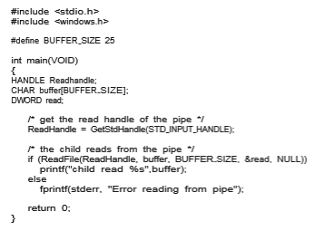

# Examples of IPC Systems

In this section, we explore four different IPC systems. We first cover the POSIX API for shared memory and then discuss message passing in the Mach oper- ating system. Next, we present Windows IPC, which interestingly uses shared memory as a mechanism for providing certain types of message passing. We conclude with pipes, one of the earliest IPC mechanisms on UNIX systems.

## POSIX Shared Memory

Several IPC mechanisms are available for POSIX systems, including shared memory and message passing. Here, we explore the POSIX API for shared memory.

POSIX shared memory is organized using memory-mapped files, which associate the region of shared memory with a file. A process must first create a shared-memory object using the shm open() system call, as follows:

fd = shm open(name, O CREAT | O RDWR, 0666);

The first parameter specifies the name of the shared-memory object. Processes that wish to access this shared memory must refer to the object by this name. The subsequent parameters specify that the shared-memory object is to be cre- ated if it does not yet exist (O CREAT) and that the object is open for reading and writing (O RDWR). The last parameter establishes the file-access permissions of the shared-memory object. A successful call to shm open() returns an integer file descriptor for the shared-memory object.

Once the object is established, the ftruncate() function is used to configure the size of the object in bytes. The call

ftruncate(fd, 4096);

sets the size of the object to 4,096 bytes. Finally, the mmap() function establishes a memory-mapped file containing

the shared-memory object. It also returns a pointer to the memory-mapped file that is used for accessing the shared-memory object.

The programs shown in Figure 3.16 and Figure 3.17 use the producer– consumer model in implementing shared memory. The producer establishes a shared-memory object and writes to shared memory, and the consumer reads from shared memory.  


**Figure 3.16** Producer process illustrating POSIX shared-memory API.  

The producer, shown in Figure 3.16, creates a shared-memory object named OS and writes the infamous string "Hello World!" to shared memory. The program memory-maps a shared-memory object of the specified size and allows writing to the object. The flag MAP SHARED specifies that changes to the shared-memory object will be visible to all processes sharing the object. Notice that we write to the shared-memory object by calling the sprintf() function and writing the formatted string to the pointer ptr. After each write, we must increment the pointer by the number of bytes written.

**Figure 3.17** Consumer process illustrating POSIX shared-memory API.  

The consumer process, shown in Figure 3.17, reads and outputs the con- tents of the shared memory. The consumer also invokes the shm unlink() function, which removes the shared-memory segment after the consumer has accessed it.We provide further exercises using the POSIX shared-memoryAPI in the programming exercises at the end of this chapter. Additionally, we provide more detailed coverage of memory mapping in Section 13.5.

## Mach Message Passing

As an example of message passing, we next consider the Mach operating system.Mach was especially designed for distributed systems, but was shown to be suitable for desktop and mobile systems as well, as evidenced by its inclusion in the macOS and iOS operating systems, as discussed in Chapter 2.

The Mach kernel supports the creation and destruction of multiple **_tasks_**, which are similar to processes but have multiple threads of control and fewer associated resources.Most communication inMach—including all inter- task communication—is carried out by **messages**. Messages are sent to, and received from,mailboxes,which are called**ports** inMach. Ports are finite in size and unidirectional; for two-way communication, a message is sent to one port, and a response is sent to a separate **_reply_** port. Each port may have multiple senders, but only one receiver. Mach uses ports to represent resources such as tasks, threads, memory, and processors, while message passing provides an object-oriented approach for interacting with these system resources and services. Message passing may occur between any two ports on the same host or on separate hosts on a distributed system.

Associated with each port is a collection of **port rights** that identify the capabilities necessary for a task to interact with the port. For example, for a task to receive a message from a port, it must have the capability MACH PORT RIGHT RECEIVE for that port. The task that creates a port is that port’s owner, and the owner is the only task that is allowed to receivemessages from that port. A port’s owner may also manipulate the capabilities for a port. This is most commonly done in establishing a reply port. For example, assume that task _T_1 owns port _P_1, and it sends a message to port _P_2, which is owned by task _T_2\. If _T_1 expects to receive a reply from _T_2, it must grant _T_2 the right MACH PORT RIGHT SEND for port _P_1\. Ownership of port rights is at the task level, which means that all threads belonging to the same task share the same port rights. Thus, two threads belonging to the same task can easily communicate by exchanging messages through the per-thread port associated with each thread.

When a task is created, two special ports—the **_Task Self_** port and the **_Notify_** port—are also created. The kernel has receive rights to the Task Self port, which allows a task to send messages to the kernel. The kernel can send notification of event occurrences to a task’s Notify port (to which, of course, the task has receive rights).

The mach port allocate() function call creates a new port and allocates space for its queue of messages. It also identifies the rights for the port. Each port right represents a **_name_** for that port, and a port can only be accessed via a right. Port names are simple integer values and behave much like UNIX file descriptors. The following example illustrates creating a port using this API:
```
mach port t port; // the name of the port right

mach port allocate( mach task self(), // a task referring to itself MACH PORT RIGHT RECEIVE, // the right for this port &port); // the name of the port right
```
Each task also has access to a **bootstrap port**, which allows a task to register a port it has createdwith a system-wide **bootstrap server**. Once a port has been registered with the bootstrap server, other tasks can look up the port in this registry and obtain rights for sending messages to the port.

The queue associated with each port is finite in size and is initially empty. As messages are sent to the port, the messages are copied into the queue. All messages are delivered reliably and have the same priority. Mach guarantees that multiple messages from the same sender are queued in first-in, first- out (FIFO) order but does not guarantee an absolute ordering. For instance, messages from two senders may be queued in any order.

Mach messages contain the following two fields:

• A fixed-size message header containing metadata about the message, including the size of the message as well as source and destination ports. Commonly, the sending thread expects a reply, so the port name of the source is passed on to the receiving task, which can use it as a “return address” in sending a reply.

• A variable-sized body containing data.

Messages may be either **_simple_** or **_complex_**. A simple message contains ordinary, unstructured user data that are not interpreted by the kernel. A complex message may contain pointers to memory locations containing data (known as “out-of-line” data) or may also be used for transferring port rights to another task. Out-of-line data pointers are especially useful when amessage must pass large chunks of data. A simple message would require copying and packaging the data in the message; out-of-line data transmission requires only a pointer that refers to the memory location where the data are stored.

The function mach msg() is the standard API for both sending and receiving messages. The value of one of the function’s parameters—either MACH SEND MSG or MACH RCV MSG—indicates if it is a send or receive operation. We now illustrate how it is used when a client task sends a simple message to a server task. Assume there are two ports—client and server—associated with the client and server tasks, respectively. The code in Figure 3.18 shows the client task constructing a header and sending a message to the server, as well as the server task receiving the message sent from the client.

The mach msg() function call is invoked by user programs for performing message passing. mach msg() then invokes the function mach msg trap(), which is a system call to the Mach kernel. Within the kernel, mach msg trap() next calls the function mach msg overwrite trap(), which then handles the actual passing of the message.  

**Figure 3.18** Example program illustrating message passing in Mach.

The send and receive operations themselves are flexible. For instance,when a message is sent to a port, its queue may be full. If the queue is not full, the message is copied to the queue, and the sending task continues. If the  

port’s queue is full, the sender has several options (specified via parameters to mach msg():

**1\.** Wait indefinitely until there is room in the queue.

**2\.** Wait at most _n_milliseconds.

**3\.** Do not wait at all but rather return immediately.

**4\.** Temporarily cache a message. Here, a message is given to the operating system to keep, even though the queue to which that message is being sent is full. When the message can be put in the queue, a notification message is sent back to the sender. Only one message to a full queue can be pending at any time for a given sending thread.

The final option is meant for server tasks. After finishing a request, a server task may need to send a one-time reply to the task that requested the service, but it must also continue with other service requests, even if the reply port for a client is full.

The major problem with message systems has generally been poor perfor- mance caused by copying of messages from the sender’s port to the receiver’s port. The Mach message system attempts to avoid copy operations by using virtual-memory-management techniques (Chapter 10). Essentially,Machmaps the address space containing the sender’s message into the receiver’s address space. Therefore, the message itself is never actually copied, as both the sender and receiver access the same memory. This message-management technique provides a large performance boost but works only for intrasystem messages.

## Windows

The Windows operating system is an example of modern design that employs modularity to increase functionality and decrease the time needed to imple- ment new features. Windows provides support for multiple operating envi- ronments, or **_subsystems._** Application programs communicate with these sub- systems via a message-passingmechanism. Thus, application programs can be considered clients of a subsystem server.

The message-passing facility in Windows is called the **advanced local pro- cedure call** (**ALPC**) facility. It is used for communication between two processes on the same machine. It is similar to the standard remote procedure call (RPC) mechanism that is widely used, but it is optimized for and specific toWindows. (Remote procedure calls are covered in detail in Section 3.8.2.) LikeMach,Win- dows uses a port object to establish and maintain a connection between two processes. Windows uses two types of ports: **connection ports** and **communi- cation ports**.

Server processes publish connection-port objects that are visible to all pro- cesses. When a client wants services from a subsystem, it opens a handle to the server’s connection-port object and sends a connection request to that port. The server then creates a channel and returns a handle to the client. The chan- nel consists of a pair of private communication ports: one for client–server messages, the other for server–client messages. Additionally, communication channels support a callback mechanism that allows the client and server to accept requests when they would normally be expecting a reply.  


**Figure 3.19** Advanced local procedure calls in Windows.

When an ALPC channel is created, one of threemessage-passing techniques is chosen:

**1\.** For small messages (up to 256 bytes), the port’s message queue is used as intermediate storage, and the messages are copied from one process to the other.

**2\.** Larger messages must be passed through a **section object**, which is a region of shared memory associated with the channel.

**3\.** When the amount of data is too large to fit into a section object, an API is available that allows server processes to read and write directly into the address space of a client.

The client has to decide when it sets up the channel whether it will need to send a large message. If the client determines that it does want to send large messages, it asks for a section object to be created. Similarly, if the server decides that replies will be large, it creates a section object. So that the section object can be used, a small message is sent that contains a pointer and size information about the section object. Thismethod ismore complicated than the firstmethod listed above, but it avoids data copying. The structure of advanced local procedure calls in Windows is shown in Figure 3.19.

It is important to note that the ALPC facility in Windows is not part of the Windows API and hence is not visible to the application programmer. Rather, applications using the Windows API invoke standard remote procedure calls. When the RPC is being invoked on a process on the same system, the RPC is handled indirectly through an ALPC procedure call. Additionally, many kernel services use ALPC to communicate with client processes.

## Pipes

A **pipe** acts as a conduit allowing two processes to communicate. Pipes were one of the first IPC mechanisms in early UNIX systems. They typically pro- vide one of the simpler ways for processes to communicate with one another, although they also have some limitations. In implementing a pipe, four issues must be considered:  

**1\.** Does the pipe allow bidirectional communication, or is communication unidirectional?

**2\.** If two-way communication is allowed, is it half duplex (data can travel only one way at a time) or full duplex (data can travel in both directions at the same time)?

**3\.** Must a relationship (such as **_parent–child_**) exist between the communi- cating processes?

**4\.** Can the pipes communicate over a network, or must the communicating processes reside on the same machine?

In the following sections, we explore two common types of pipes used on both UNIX and Windows systems: ordinary pipes and named pipes.

### Ordinary Pipes

Ordinary pipes allow two processes to communicate in standard producer– consumer fashion: the producer writes to one end of the pipe (the **write end**) and the consumer reads from the other end (the **read end**). As a result, ordinary pipes are unidirectional, allowing only one-way communication. If two-way communication is required, two pipes must be used, with each pipe sending data in a different direction. We next illustrate constructing ordinary pipes on both UNIX and Windows systems. In both program examples, one process writes the message Greetings to the pipe, while the other process reads this message from the pipe.

On UNIX systems, ordinary pipes are constructed using the function

pipe(int fd\[\])

This function creates a pipe that is accessed through the int fd[] file descrip- tors: fd[0] is the read end of the pipe, and fd[1] is the write end. UNIX treats a pipe as a special type of file. Thus, pipes can be accessed using ordinary read() and write() system calls.

An ordinary pipe cannot be accessed from outside the process that created it. Typically, a parent process creates a pipe and uses it to communicate with a child process that it creates via fork(). Recall from Section 3.3.1 that a child process inherits open files from its parent. Since a pipe is a special type of file, the child inherits the pipe from its parent process. Figure 3.20 illustrates

**Figure 3.20** File descriptors for an ordinary pipe.  

**Figure 3.21** Ordinary pipe in UNIX.

the relationship of the file descriptors in the fd array to the parent and child processes. As this illustrates, any writes by the parent to its write end of the pipe—fd[1]—can be read by the child from its read end—fd[0]—of the pipe.

In the UNIX program shown in Figure 3.21, the parent process creates a pipe and then sends a fork() call creating the child process. What occurs after the fork() call depends on how the data are to flow through the pipe. In this instance, the parent writes to the pipe, and the child reads from it. It is important to notice that both the parent process and the child process initially close their unused ends of the pipe. Although the program shown in Figure 3.21 does not require this action, it is an important step to ensure that a process reading from the pipe can detect end-of-file (read() returns 0) when thewriter has closed its end of the pipe.

Ordinary pipes on Windows systems are termed **anonymous pipes**, and they behave similarly to their UNIX counterparts: they are unidirectional and employ parent–child relationships between the communicating processes. In addition, reading and writing to the pipe can be accomplished with the ordi- nary ReadFile() and WriteFile() functions. The Windows API for creating pipes is the CreatePipe() function, which is passed four parameters. The parameters provide separate handles for (1) reading and (2) writing to the pipe, as well as (3) an instance of the STARTUPINFO structure, which is used to specify that the child process is to inherit the handles of the pipe. Furthermore, (4) the size of the pipe (in bytes) may be specified.

Figure 3.23 illustrates a parent process creating an anonymous pipe for communicating with its child. Unlike UNIX systems, in which a child pro- cess automatically inherits a pipe created by its parent, Windows requires the programmer to specify which attributes the child process will inherit. This is  

**Figure 3.22** Figure 3.21, continued.

accomplished by first initializing the SECURITY ATTRIBUTES structure to allow handles to be inherited and then redirecting the child process’s handles for standard input or standard output to the read or write handle of the pipe. Since the child will be reading from the pipe, the parent must redirect the child’s standard input to the read handle of the pipe. Furthermore, as the pipes are half duplex, it is necessary to prohibit the child from inheriting the write end of the  

**Figure 3.23** Windows anonymous pipe—parent process.

pipe. The program to create the child process is similar to the program in Figure 3.10, except that the fifth parameter is set to TRUE, indicating that the child process is to inherit designated handles from its parent. Before writing to the pipe, the parent first closes its unused read end of the pipe. The child process that reads from the pipe is shown in Figure 3.25. Before reading from the pipe, this programobtains the readhandle to the pipe by invoking GetStdHandle().

Note that ordinary pipes require a parent–child relationship between the communicating processes on both UNIX and Windows systems. This means that these pipes can be used only for communication between processes on the same machine.

### Named Pipes

Ordinary pipes provide a simple mechanism for allowing a pair of processes to communicate. However, ordinary pipes exist only while the processes are communicating with one another. On both UNIX and Windows systems, once the processes have finished communicating and have terminated, the ordinary pipe ceases to exist.

Named pipes provide a much more powerful communication tool. Com- munication can be bidirectional, and no parent–child relationship is required. Once a named pipe is established, several processes can use it for communi- cation. In fact, in a typical scenario, a named pipe has several writers. Addi- tionally, named pipes continue to exist after communicating processes have finished. Both UNIX andWindows systems support named pipes, although the details of implementation differ greatly. Next, we explore named pipes in each of these systems.

Named pipes are referred to as FIFOs in UNIX systems. Once created, they appear as typical files in the file system. A FIFO is created with the mkfifo() system call and manipulated with the ordinary open(), read(), write(), and close() system calls. It will continue to exist until it is explicitly deleted  

**Figure 3.24** Figure 3.23, continued.  

**Figure 3.25** Windows anonymous pipes—child process.

from the file system. Although FIFOs allow bidirectional communication, only half-duplex transmission is permitted. If data must travel in both directions, two FIFOs are typically used. Additionally, the communicating processes must reside on the same machine. If intermachine communication is required, sock- ets (Section 3.8.1) must be used.

Named pipes onWindows systems provide a richer communicationmech- anism than their UNIX counterparts. Full-duplex communication is allowed, and the communicating processes may reside on either the same or different machines. Additionally, only byte-oriented data may be transmitted across a UNIX FIFO, whereas Windows systems allow either byte- or message-oriented data. Named pipes are created with the CreateNamedPipe() function, and a client can connect to a named pipe using ConnectNamedPipe(). Communi- cation over the named pipe can be accomplished using the ReadFile() and WriteFile() functions.