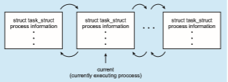
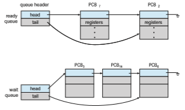
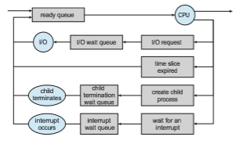

# Process Scheduling

The objective ofmultiprogramming is to have someprocess running at all times so as to maximize CPU utilization. The objective of time sharing is to switch a CPU core among processes so frequently that users can interact with each program while it is running. To meet these objectives, the **process scheduler** selects an available process (possibly from a set of several available processes) for program execution on a core. Each CPU core can run one process at a time.  

**_PROCESS REPRESENTATION IN LINUX_**

The process control block in the Linux operating system is rep- resented by the C structure task struct, which is found in the <include/linux/sched.h> include file in the kernel source-code directory. This structure contains all the necessary information for representing a process, including the state of the process, scheduling and memory-management information, list of open files, and pointers to the process’s parent and a list of its children and siblings. (A process’s **parent** is the process that created it; its **children** are any processes that it creates. Its **siblings** are children with the same parent process.) Some of these fields include:

long state;     /\* state of the process \*/ 
struct sched entity se;     /\* scheduling information \*/ 
struct task struct \*parent;     /\* this process’s parent \*/ 
struct list head children;    /\* this process’s children \*/ 
struct files struct \*files;    /\* list of open files \*/ 
struct mm struct \*mm;    /\* address space \*/

For example, the state of a process is represented by the field long state in this structure. Within the Linux kernel, all active processes are represented using a doubly linked list of task struct. The kernel maintains a pointer– current–to the process currently executing on the system, as shown below:

As an illustration of how the kernel might manipulate one of the fields in the task struct for a specified process, let’s assume the system would like to change the state of the process currently running to the value new state. If current is a pointer to the process currently executing, its state is changed with the following:

current->state = new state;

For a system with a single CPU core, there will never be more than one process running at a time, whereas a multicore system can run multiple processes at one time. If there are more processes than cores, excess processes will have  

**Figure 3.4** The ready queue and wait queues.

to wait until a core is free and can be rescheduled. The number of processes currently in memory is known as the **degree of multiprogramming**.

Balancing the objectives of multiprogramming and time sharing also requires taking the general behavior of a process into account. In general, most processes can be described as either I/O bound or CPU bound. An **I/O-bound process** is one that spends more of its time doing I/O than it spends doing computations. A **CPU-bound process**, in contrast, generates I/O requests infrequently, using more of its time doing computations.

## Scheduling Queues

As processes enter the system, they are put into a **ready queue**, where they are ready and waiting to execute on a CPU’s core This queue is generally stored as a linked list; a ready-queue header contains pointers to the first PCB in the list, and each PCB includes a pointer field that points to the next PCB in the ready queue.

The system also includes other queues. When a process is allocated a CPU core, it executes for a while and eventually terminates, is interrupted, or waits for the occurrence of a particular event, such as the completion of an I/O request. Suppose the process makes an I/O request to a device such as a disk. Since devices run significantly slower than processors, the process will have to wait for the I/O to become available. Processes that are waiting for a certain event to occur — such as completion of I/O — are placed in a **wait queue** (Figure 3.4).

A common representation of process scheduling is a **queueing diagram**, such as that in Figure 3.5. Two types of queues are present: the ready queue and a set of wait queues. The circles represent the resources that serve the queues, and the arrows indicate the flow of processes in the system.

A new process is initially put in the ready queue. It waits there until it is selected for execution, or **dispatched**. Once the process is allocated a CPU core and is executing, one of several events could occur:  

**Figure 3.5** Queueing-diagram representation of process scheduling.

• The process could issue an I/O request and then be placed in an I/O wait queue.

• The process could create a new child process and then be placed in a wait queue while it awaits the child’s termination.

• The process could be removed forcibly from the core, as a result of an interrupt or having its time slice expire, and be put back in the readyqueue.

In the first two cases, the process eventually switches from thewaiting state to the ready state and is then put back in the ready queue. Aprocess continues this cycle until it terminates, at which time it is removed from all queues and has its PCB and resources deallocated.

## CPU Scheduling

Aprocess migrates among the ready queue and various wait queues through- out its lifetime. The role of the **CPU scheduler** is to select from among the processes that are in the ready queue and allocate a CPU core to one of them. The CPU scheduler must select a new process for the CPU frequently. An I/O-bound process may execute for only a few milliseconds before waiting for an I/O request.Although a CPU-bound processwill require a CPU core for longer dura- tions, the scheduler is unlikely to grant the core to a process for an extended period. Instead, it is likely designed to forcibly remove the CPU from a process and schedule another process to run. Therefore, the CPU scheduler executes at least once every 100 milliseconds, although typically much more frequently.

Some operating systems have an intermediate form of scheduling, known as **swapping**, whose key idea is that sometimes it can be advantageous to remove a process from memory (and from active contention for the CPU) and thus reduce the degree of multiprogramming. Later, the process can be reintroduced into memory, and its execution can be continued where it left off. This scheme is known as **_swapping_** because a process can be “swapped out”  

from memory to disk, where its current status is saved, and later “swapped in” from disk back to memory, where its status is restored. Swapping is typically only necessary when memory has been overcommitted and must be freed up. Swapping is discussed in Chapter 9.

## Context Switch

Asmentioned in Section 1.2.1, interrupts cause the operating system to change a CPU core from its current task and to run a kernel routine. Such operations happen frequently on general-purpose systems. When an interrupt occurs, the system needs to save the current **context** of the process running on the CPU core so that it can restore that context when its processing is done, essentially suspending the process and then resuming it. The context is represented in the PCB of the process. It includes the value of the CPU registers, the process state (see Figure 3.2), and memory-management information. Generically, we perform a **state save** of the current state of the CPU core, be it in kernel or user mode, and then a **state restore** to resume operations.

Switching the CPU core to another process requires performing a state save of the current process and a state restore of a different process. This task is known as a **context switch** and is illustrated in Figure 3.6. When a context switch occurs, the kernel saves the context of the old process in its PCB and loads the saved context of the new process scheduled to run. Context- switch time is pure overhead, because the system does no useful work while switching. Switching speed varies frommachine tomachine, depending on the

**Figure 3.6** Diagram showing context switch from process to process.  

**_MULTITASKING IN MOBILE SYSTEMS_**

Because of the constraints imposed on mobile devices, early versions of iOS did not provide user-application multitasking; only one application ran in the foregroundwhile all other user applications were suspended. Operating- system tasks were multitasked because they were written by Apple and well behaved. However, beginning with iOS 4, Apple provided a limited form of multitasking for user applications, thus allowing a single foreground appli- cation to run concurrently with multiple background applications. (On a mobile device, the **foreground** application is the application currently open and appearing on the display. The **background** application remains in mem- ory, but does not occupy the display screen.) The iOS 4 programming API provided support formultitasking, thus allowing a process to run in the back- groundwithout being suspended.However, it was limited and only available for a few application types. As hardware for mobile devices began to offer larger memory capacities, multiple processing cores, and greater battery life, subsequent versions of iOS began to support richer functionality for multi- tasking with fewer restrictions. For example, the larger screen on iPad tablets allowed running two foreground apps at the same time, a technique known as **split-screen**.

Since its origins, Android has supported multitasking and does not place constraints on the types of applications that can run in the background. If an application requires processing while in the background, the application must use a **service**, a separate application component that runs on behalf of the background process. Consider a streaming audio application: if the application moves to the background, the service continues to send audio data to the audio device driver on behalf of the background application. In fact, the service will continue to run even if the background application is suspended. Services do not have a user interface and have a small memory footprint, thus providing an efficient technique for multitasking in a mobile environment.

memory speed, the number of registers that must be copied, and the existence of special instructions (such as a single instruction to load or store all registers). A typical speed is a several microseconds.

Context-switch times are highly dependent on hardware support. For instance, some processors provide multiple sets of registers. A context switch here simply requires changing the pointer to the current register set. Of course, if there are more active processes than there are register sets, the system resorts to copying register data to and frommemory, as before. Also, themore complex the operating system, the greater the amount of work that must be done during a context switch. As we will see in Chapter 9, advanced memory-management techniques may require that extra data be switched with each context. For instance, the address space of the current process must be preserved as the space of the next task is prepared for use. How the address space is preserved, and what amount of work is needed to preserve it, depend on the memory- management method of the operating system. 